# ATS — Applicant Tracking System API

> REST API para gerenciamento de processos seletivos, construída com ASP.NET Core 10, Domain-Driven Design e observabilidade de produção.

[](https://dotnet.microsoft.com)
[](https://www.mongodb.com)
[](docs/bdd/README.md)
[](LICENSE)
[](https://github.com/MarlonReis/ATS.TalentTrack/actions/workflows/ci.yml)


---

> **📋 Documentação de regras de negócio em BDD/Gherkin:** [`docs/bdd/`](docs/bdd/README.md)  
> ~101 cenários cobrindo Candidatos, Vagas, Candidaturas, Paginação e Tratamento de Erros — prontos para automação com Reqnroll/SpecFlow.

---

## Sumário

- [Objetivo](#objetivo)
- [Funcionalidades](#funcionalidades)
- [Tecnologias](#tecnologias)
- [Arquitetura](#arquitetura)
- [Estrutura de diretórios](#estrutura-de-diretórios)
- [Pré-requisitos](#pré-requisitos)
- [Execução local (.NET CLI)](#execução-local-net-cli)
- [Execução via Docker Compose](#execução-via-docker-compose)
- [Variáveis de ambiente](#variáveis-de-ambiente)
- [Banco de dados](#banco-de-dados)
- [Swagger / OpenAPI](#swagger--openapi)
- [Endpoints da API](#endpoints-da-api)
- [Eventos de domínio](#eventos-de-domínio)
- [Diagramas de sequência](#diagramas-de-sequência)
- [Testes](#testes)
- [Cobertura de código](#cobertura-de-código)
- [Observabilidade](#observabilidade)
- [Decisões técnicas](#decisões-técnicas)
- [Convenções de desenvolvimento](#convenções-de-desenvolvimento)
- [Tratamento de erros](#tratamento-de-erros)
- [CI/CD](#cicd)
- [**Documentação BDD**](#documentação-bdd) — [📋 Abrir docs/bdd/](docs/bdd/README.md)
- [Roadmap](#roadmap)
- [Licença](#licença)
- [Autor](#autor)

---

## Objetivo

O ATS é um sistema de rastreamento de candidatos (Applicant Tracking System) desenvolvido como desafio técnico para demonstrar a aplicação de boas práticas de engenharia de software em projetos .NET. A API gerencia os três agregados centrais de um processo seletivo: **Candidatos**, **Vagas** e **Candidaturas**, com transições de estado controladas por regras de domínio.

---

## Funcionalidades

| Área | Operações |
|------|-----------|
| **Candidatos** | Cadastro, consulta, listagem paginada, atualização de contato, upload de currículo |
| **Vagas** | Publicação, consulta, listagem paginada, atualização, encerramento, exclusão |
| **Candidaturas** | Criação, consulta, listagem por vaga, aprovação, reprovação, cancelamento |
| **Eventos de domínio** | Dispatch interno via MediatR, auditoria, notificações por log e automações pós-evento |
| **Observabilidade** | Logs estruturados (JSON), tracing distribuído (OTLP/Jaeger), métricas Prometheus, health checks |

---

## Tecnologias

| Camada | Tecnologia |
|--------|-----------|
| Runtime | [.NET 10](https://dotnet.microsoft.com) / ASP.NET Core 10 |
| Banco de dados | [MongoDB 7.0](https://www.mongodb.com) via [MongoDB.Driver](https://www.nuget.org/packages/MongoDB.Driver) |
| Logs | [Serilog](https://serilog.net) + Compact JSON Formatter |
| Eventos internos | [MediatR](https://github.com/jbogard/MediatR) para publicação de eventos de domínio |
| Tracing | [OpenTelemetry](https://opentelemetry.io) (OTLP exporter, Jaeger) |
| Métricas | OpenTelemetry Metrics + [Prometheus](https://prometheus.io) |
| Testes | [xUnit](https://xunit.net) + [Moq](https://github.com/moq/moq4) |
| Cobertura | [Coverlet](https://github.com/coverlet-coverage/coverlet) + [ReportGenerator](https://github.com/danielpalme/ReportGenerator) |
| Containerização | [Docker](https://www.docker.com) + Docker Compose |
| CI | [GitHub Actions](https://github.com/features/actions) |

---

## Arquitetura

O projeto segue a arquitetura em camadas do **Domain-Driven Design (DDD)**, com separação estrita de responsabilidades:

```
┌─────────────────────────────────────────────────────────────┐
│                        ATS.API                              │
│  Controllers · Middlewares · Observability · Program.cs     │
└───────────────┬───────────────────────────────┬─────────────┘
                │ usa handlers                  │ usa DI concreta
┌───────────────▼────────────────┐   ┌──────────▼─────────────┐
│        ATS.Application          │   │    ATS.Infrastructure   │
│ Commands · Queries · Handlers   │   │ Repositories · MongoDB  │
│ Events · DTOs · Metrics         │   │ Event Dispatcher · DI    │
└───────────────┬────────────────┘   └──────────┬─────────────┘
                │ depende de                     │ implementa interfaces
┌───────────────▼────────────────────────────────▼─────────────┐
│                         ATS.Domain                            │
│ Entities · Value Objects · Aggregates · Domain Events         │
│ Repository Interfaces · DomainException                       │
└───────────────────────────────────────────────────────────────┘
```

> **Nota arquitetural:** `ATS.Application` não referencia `ATS.Infrastructure`. A API referencia os dois projetos e usa `ATS.Infrastructure.DependencyInjection` como composition root prático para registrar repositórios, health checks e handlers. Em uma Clean Architecture mais estrita, os registros de handlers poderiam viver em um `ATS.Application.DependencyInjection` separado.

### Responsabilidades por camada

**`ATS.Domain`** — núcleo da aplicação, sem dependências de infraestrutura ou persistência.
- Entidades (`Candidato`, `Vaga`, `Candidatura`) e regras de negócio via métodos de domínio
- Value Objects imutáveis (`Email`, `Telefone`, `Salario`, `Curriculo`) com validação encapsulada
- Enums de estado (`StatusCandidatura`, `StatusVaga`)
- Eventos de domínio (`CandidatoCriadoEvent`, `CandidaturaAprovadaEvent`, `VagaFechadaEvent`, etc.) implementando `IDomainEvent`
- Interfaces de repositório (`ICandidatoRepository`, `IVagaRepository`, `ICandidaturaRepository`)
- `DomainException` como mecanismo de sinalização de invariantes violadas

> `IDomainEvent` estende `MediatR.INotification`; essa é a única dependência técnica do domínio e existe para permitir dispatch interno sem acoplamento com infraestrutura de persistência.

**`ATS.Application`** — orquestração dos casos de uso.
- Handlers de Commands (operações de escrita) e Queries (operações de leitura) por agregado
- Event handlers MediatR para auditoria, notificações e automações internas pós-evento
- `IDomainEventDispatcher` como contrato de publicação e limpeza de eventos dos agregados
- DTOs para projeção de dados entre camadas
- `PagedResult<T>` para respostas paginadas
- `AtsMetrics` com contadores OpenTelemetry para métricas de negócio
- Sem referência a frameworks web ou de persistência

**`ATS.Infrastructure`** — implementações de infraestrutura.
- Implementações concretas dos repositórios usando `MongoDB.Driver`
- `MongoDbContext` e mapeamento BSON via `BsonClassMap`
- `MediatRDomainEventDispatcher` para publicar `IDomainEvent` e limpar a fila do agregado
- `MongoDbHealthCheck` para o health check `ready`
- `DependencyInjection` — registro de todos os serviços e handlers no container IoC

**`ATS.API`** — camada de entrada HTTP.
- Controllers com rotas versionadas (`/api/v1/...`) e documentação XML
- `ExceptionHandlingMiddleware` — traduz exceções para `ProblemDetails` (RFC 7807)
- `ObservabilityExtensions` — configura Serilog, OpenTelemetry e Prometheus
- Cabeçalhos de segurança (CSP, X-Frame-Options, etc.)
- Health checks (`/health/live`, `/health/ready`)
- `Program.cs` com configuração de CORS, `ForwardedHeaders` e Swagger

**`tests/`** — estratégia de testes em cinco projetos:
- `ATS.Domain.Tests` — regras de domínio, value objects e invariantes
- `ATS.Application.Tests` — handlers, event handlers e repositórios mockados (MockBehavior.Strict)
- `ATS.Infrastructure.Tests` — repositórios contra MongoDB em memória/real e dispatcher MediatR
- `ATS.API.Tests` — controllers, middlewares e extensões de observabilidade
- `ATS.E2E.Tests` — fluxos completos com Testcontainers + MongoDB real

---

## Estrutura de diretórios

```
ATS.Solution/
├── src/
│   ├── ATS.API/
│   │   ├── Controllers/
│   │   │   ├── CandidatosController.cs
│   │   │   ├── VagasController.cs
│   │   │   └── CandidaturasController.cs
│   │   ├── Middlewares/
│   │   │   └── ExceptionHandlingMiddleware.cs
│   │   ├── Observability/
│   │   │   ├── ObservabilityExtensions.cs
│   │   │   └── ObservabilitySettings.cs
│   │   ├── Requests/
│   │   ├── appsettings.json
│   │   ├── appsettings.Development.json
│   │   ├── Dockerfile
│   │   └── Program.cs
│   │
│   ├── ATS.Application/
│   │   ├── Candidatos/
│   │   │   ├── Commands/          # CreateCandidato, UpdateCandidato, DeleteCandidato, AddCurriculo
│   │   │   ├── Queries/           # GetCandidatoById, ListCandidatos
│   │   │   └── DTOs/
│   │   ├── Vagas/
│   │   │   ├── Commands/          # CreateVaga, UpdateVaga, DeleteVaga, FecharVaga
│   │   │   ├── Events/            # FecharVagaAposPrimeiraAprovacaoHandler
│   │   │   ├── Queries/           # GetVagaById, ListVagas
│   │   │   └── DTOs/
│   │   ├── Candidaturas/
│   │   │   ├── Commands/          # CandidatarSe, AprovarCandidatura, ReprovarCandidatura, CancelarCandidatura
│   │   │   ├── Events/            # Auditoria, notificação e cancelamento automático
│   │   │   ├── Queries/           # GetCandidaturaById, ListCandidatosPorVaga
│   │   │   └── DTOs/
│   │   ├── Common/
│   │   │   ├── Events/            # IDomainEventDispatcher
│   │   │   └── Pagination/        # PagedResult<T>
│   │   └── Observability/
│   │       └── AtsMetrics.cs
│   │
│   ├── ATS.Domain/
│   │   ├── Candidatos/
│   │   │   ├── Entities/          # Candidato
│   │   │   ├── Events/            # CandidatoCriadoEvent, CurriculoAdicionadoEvent
│   │   │   ├── Repositories/      # ICandidatoRepository
│   │   │   └── ValueObjects/      # Email, Telefone, Curriculo
│   │   ├── Vagas/
│   │   │   ├── Entities/          # Vaga
│   │   │   ├── Enums/             # StatusVaga
│   │   │   ├── Events/            # VagaPublicadaEvent, VagaFechadaEvent
│   │   │   ├── Repositories/      # IVagaRepository
│   │   │   └── ValueObjects/      # Salario
│   │   ├── Candidaturas/
│   │   │   ├── Entities/          # Candidatura
│   │   │   ├── Enums/             # StatusCandidatura
│   │   │   ├── Events/            # Realizada, Aprovada, Reprovada, Cancelada
│   │   │   └── Repositories/      # ICandidaturaRepository
│   │   └── Shared/
│   │       ├── AggregateRoot.cs
│   │       ├── Entity.cs
│   │       ├── ValueObject.cs
│   │       ├── IDomainEvent.cs
│   │       └── DomainException.cs
│   │
│   └── ATS.Infrastructure/
│       ├── Events/
│       │   └── MediatRDomainEventDispatcher.cs
│       ├── Health/
│       │   └── MongoDbHealthCheck.cs
│       ├── Persistence/
│       │   ├── Context/           # MongoDbContext, MongoDbSettings
│       │   ├── Mappings/          # BsonClassMap para cada agregado
│       │   └── Repositories/      # CandidatoRepository, VagaRepository, CandidaturaRepository
│       └── DependencyInjection.cs
│
├── tests/
│   ├── ATS.Domain.Tests/
│   ├── ATS.Application.Tests/
│   ├── ATS.Infrastructure.Tests/
│   ├── ATS.API.Tests/
│   └── ATS.E2E.Tests/
│
├── docs/
│   └── bdd/
│       ├── README.md              # Índice, convenções e instruções de automação
│       ├── Candidatos.feature     # Regras de negócio de candidatos (Gherkin)
│       ├── Vagas.feature          # Regras de negócio de vagas (Gherkin)
│       ├── Candidaturas.feature   # Regras de negócio de candidaturas (Gherkin)
│       ├── Paginacao.feature      # Regras de paginação (Gherkin)
│       └── TratamentoDeErros.feature # Comportamento de erros (Gherkin)
├── infra/
│   └── prometheus.yml
├── docker-compose.yml
└── ATS.Solution.slnx
```

---

## Pré-requisitos

| Ferramenta | Versão mínima | Uso |
|------------|--------------|-----|
| [.NET SDK](https://dotnet.microsoft.com/download) | 10.0 | Build e execução local |
| [Docker](https://www.docker.com/get-started) | 24+ | Containerização e serviços auxiliares |
| [Docker Compose](https://docs.docker.com/compose/) | v2 | Orquestração local |
| [MongoDB](https://www.mongodb.com/try/download/community) | 7.0 | Apenas para execução sem Docker |

---

## Execução local (.NET CLI)

### 1. Clonar o repositório

```bash
git clone https://github.com/MarlonReis/ATS.TalentTrack.git
cd ATS.TalentTrack
```

### 2. Configurar o banco de dados

Certifique-se de ter o MongoDB rodando localmente na porta padrão `27017` (sem autenticação).  
O arquivo `appsettings.Development.json` já aponta para `mongodb://localhost:27017` com o banco `AtsDbLocal`.

### 3. Restaurar dependências e executar

```bash
dotnet restore
dotnet run --project src/ATS.API
```

A API ficará disponível em:
- **HTTP**: `http://localhost:5031`
- **Swagger UI**: `http://localhost:5031/swagger`
- **Métricas**: `http://localhost:5031/metrics`
- **Health live**: `http://localhost:5031/health/live`
- **Health ready**: `http://localhost:5031/health/ready`

---

## Execução via Docker Compose

### 1. Criar o arquivo `.env`

```bash
cp .env.example .env  # ou crie manualmente
```

Conteúdo mínimo do `.env`:

```env
MONGO_ROOT_USERNAME=admin
MONGO_ROOT_PASSWORD=changeme_strong_password
MONGO_DATABASE_NAME=AtsDb
API_HTTP_PORT=5031
```

### 2. Subir os serviços principais

```bash
docker compose up -d
```

Serviços iniciados:
- `ats-api` — API na porta configurada em `API_HTTP_PORT` (default: `5031`)
- `ats-mongo` — MongoDB na porta `27017` (acesso local apenas via `127.0.0.1`)

### 3. Subir com ferramentas de observabilidade (opcional)

```bash
docker compose --profile observability up -d
```

Adiciona:
- `ats-jaeger` — UI de tracing em `http://localhost:16686`
- `ats-prometheus` — em `http://localhost:9090`

### 4. Subir com interface de administração do MongoDB (opcional)

```bash
docker compose --profile tools up -d
```

Adiciona:
- `ats-mongo-express` — em `http://localhost:8081` (requer usuário/senha configurados)

### Comandos úteis

```bash
# Ver logs da API em tempo real
docker compose logs -f api

# Parar todos os serviços
docker compose down

# Parar e remover volumes (apaga os dados do MongoDB)
docker compose down -v

# Rebuild da imagem da API
docker compose build api
```

---

## Variáveis de ambiente

| Variável | Padrão | Descrição |
|----------|--------|-----------|
| `ASPNETCORE_ENVIRONMENT` | `Production` | Ambiente (`Development`, `Production`) |
| `MongoDB__ConnectionString` | — | Connection string completa do MongoDB |
| `MongoDB__DatabaseName` | `AtsDb` | Nome do banco de dados |
| `MongoDB__MaxConnectionPoolSize` | `100` | Tamanho máximo do pool de conexões |
| `Cors__AllowedOrigins` | `""` | Origins permitidas (separadas por vírgula) |
| `Observability__ServiceName` | `ats-api` | Nome do serviço no OTLP/Jaeger |
| `Observability__OtlpEndpoint` | `""` | Endpoint OTLP (ex: `http://jaeger:4317`) |
| `Observability__EnablePrometheusEndpoint` | `true` | Habilita `/metrics` |
| `Observability__EnableConsoleExporter` | `false` | Exporta traces e métricas para console |
| `API_HTTP_PORT` | `5031` | Porta local exposta pelo Compose |
| `MONGO_ROOT_USERNAME` | — | **Obrigatório** — usuário root do MongoDB |
| `MONGO_ROOT_PASSWORD` | — | **Obrigatório** — senha root do MongoDB |

> **Segurança:** nunca comite o arquivo `.env` com credenciais reais. O `.gitignore` já exclui esse arquivo.

---

## Banco de dados

O projeto utiliza **MongoDB 7.0** como banco de dados principal. Por ser um banco de documentos, não há migrations no estilo relacional — a estrutura das coleções evolui junto com o código.

### Coleções

| Coleção | Agregado |
|---------|---------|
| `candidatos` | `Candidato` |
| `vagas` | `Vaga` |
| `candidaturas` | `Candidatura` |

### Mapeamento

O mapeamento entre classes C# e documentos BSON é feito via `BsonClassMap` registrado em `ATS.Infrastructure/Persistence/Mappings/`. Isso elimina a dependência de atributos de serialização nas entidades de domínio, mantendo o Domain Model limpo.

### Índices

Os índices são criados automaticamente pelo MongoDB conforme necessário. Para ambientes de produção com alto volume, considere criar índices explícitos (listados no [Roadmap](#roadmap)).

---

## Swagger / OpenAPI

O Swagger UI está disponível **apenas em ambiente Development**:

```
http://localhost:5031/swagger
```

A especificação OpenAPI em JSON está disponível em:

```
http://localhost:5031/swagger/v1/swagger.json
```

Os endpoints são documentados com `[ProducesResponseType]` e comentários XML gerados automaticamente.

---

## Endpoints da API

### Candidatos

```
POST   /api/v1/candidatos              → 201 Created
GET    /api/v1/candidatos              → 200 OK (paginado)
GET    /api/v1/candidatos/{id}         → 200 OK | 404 Not Found
PUT    /api/v1/candidatos/{id}         → 200 OK | 404 Not Found
DELETE /api/v1/candidatos/{id}         → 204 No Content | 404 Not Found
POST   /api/v1/candidatos/{id}/curriculo → 200 OK | 404 Not Found
```

### Vagas

```
POST   /api/v1/vagas                   → 201 Created
GET    /api/v1/vagas                   → 200 OK (paginado)
GET    /api/v1/vagas/{id}              → 200 OK | 404 Not Found
PUT    /api/v1/vagas/{id}              → 200 OK | 404 Not Found
DELETE /api/v1/vagas/{id}              → 204 No Content | 404 Not Found
PATCH  /api/v1/vagas/{id}/fechar       → 200 OK | 404 Not Found | 409 Conflict
```

### Candidaturas

```
POST   /api/v1/candidaturas                        → 201 Created | 409 Conflict
GET    /api/v1/candidaturas/{id}                   → 200 OK | 404 Not Found
GET    /api/v1/candidaturas/vagas/{vagaId}/candidatos → 200 OK | 404 Not Found
PATCH  /api/v1/candidaturas/{id}/aprovar              → 200 OK | 404 | 409 Conflict
PATCH  /api/v1/candidaturas/{id}/reprovar             → 200 OK | 404 | 409 Conflict
PATCH  /api/v1/candidaturas/{id}/cancelar             → 200 OK | 404 | 409 Conflict
```

### Infraestrutura

```
GET    /health/live    → 200 OK | 503 Service Unavailable
GET    /health/ready   → 200 OK | 503 Service Unavailable
GET    /metrics        → texto Prometheus
```

---

## Eventos de domínio

O projeto usa eventos de domínio para desacoplar regras secundárias de efeitos colaterais do fluxo principal dos casos de uso. Os agregados registram eventos em memória por meio de `AddDomainEvent(...)`; os handlers de Application persistem o agregado e, em seguida, chamam `IDomainEventDispatcher.DispatchAndClearAsync(...)`. A implementação concreta fica em `ATS.Infrastructure.Events.MediatRDomainEventDispatcher` e publica os eventos via MediatR.

> **Escopo atual:** os eventos são internos ao processo da API. Não há outbox, fila, retry persistente ou mensageria externa. A publicação acontece dentro do ciclo da requisição HTTP, após a persistência do agregado principal.

### Modelo de execução

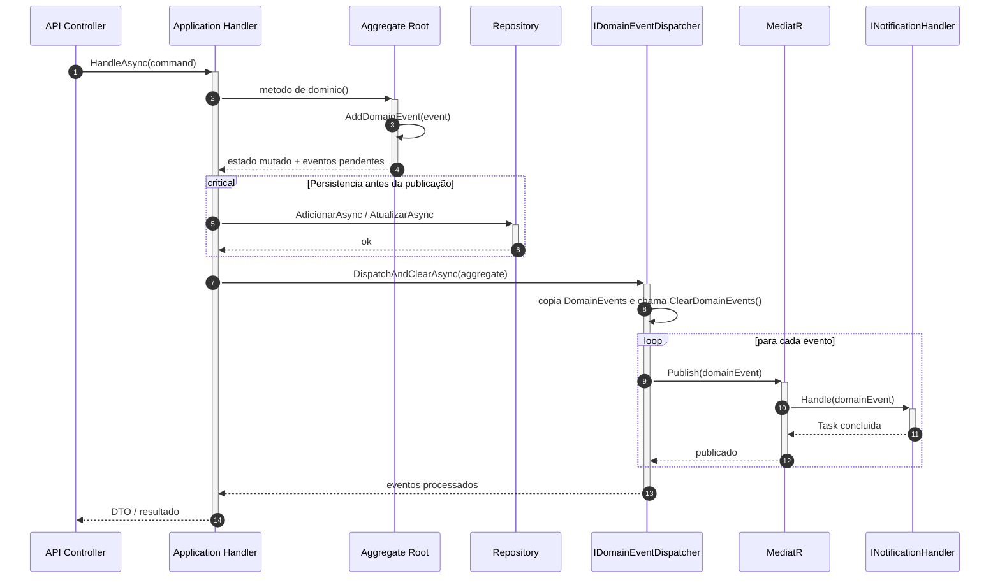

**Passo a passo**

1. O controller delega a operação ao handler de Application.
2. O handler invoca um método de domínio, como `Candidatura.Aprovar()` ou `Vaga.Fechar()`.
3. O agregado altera seu estado e adiciona um ou mais `IDomainEvent` à coleção `DomainEvents`.
4. O repositório persiste o agregado no MongoDB antes de qualquer publicação.
5. O dispatcher copia os eventos, limpa a coleção do agregado e publica cada evento via MediatR.
6. Os event handlers executam efeitos internos como logs de auditoria, notificações por log e automações de estado.

### Catálogo de eventos

| Evento | Disparado por | Agregado | Publicado por |
|--------|---------------|----------|---------------|
| `CandidatoCriadoEvent` | `Candidato.Criar()` | `Candidato` | `CreateCandidatoHandler` |
| `CurriculoAdicionadoEvent` | `Candidato.AdicionarCurriculo()` | `Candidato` | `AddCurriculoHandler` |
| `VagaPublicadaEvent` | `Vaga.Criar()` | `Vaga` | `CreateVagaHandler` |
| `VagaFechadaEvent` | `Vaga.Fechar()` | `Vaga` | `FecharVagaHandler` |
| `CandidaturaRealizadaEvent` | `Candidatura.Criar()` | `Candidatura` | `CandidatarSeHandler` |
| `CandidaturaAprovadaEvent` | `Candidatura.Aprovar()` | `Candidatura` | `AprovarCandidaturaHandler` |
| `CandidaturaReprovadaEvent` | `Candidatura.Reprovar()` | `Candidatura` | `ReprovarCandidaturaHandler` |
| `CandidaturaCanceladaEvent` | `Candidatura.Cancelar()` | `Candidatura` | `CancelarCandidaturaHandler` |

### Event handlers registrados

| Handler | Evento consumido | Responsabilidade atual |
|---------|------------------|------------------------|
| `AuditoriaCandidaturaHandler` | `CandidaturaRealizadaEvent`, `CandidaturaAprovadaEvent`, `CandidaturaReprovadaEvent`, `CandidaturaCanceladaEvent` | Registra log estruturado de auditoria da candidatura |
| `NotificarCandidatoAprovadoHandler` | `CandidaturaAprovadaEvent` | Registra log de notificação de aprovação |
| `NotificarCandidatoReprovadoHandler` | `CandidaturaReprovadaEvent` | Registra log de notificação de reprovação |
| `FecharVagaAposPrimeiraAprovacaoHandler` | `CandidaturaAprovadaEvent` | Fecha a vaga quando uma candidatura é aprovada |
| `CancelarCandidaturasPendentesHandler` | `VagaFechadaEvent` | Cancela candidaturas `EmAnalise` quando a vaga é fechada pelo fluxo explícito |

### Pontos de consistência

- O dispatcher limpa `DomainEvents` antes de publicar para evitar reprocessamento do mesmo agregado na mesma instância.
- Não há outbox transacional; se um event handler falhar, o agregado principal já foi persistido.
- `FecharVagaAposPrimeiraAprovacaoHandler` fecha a vaga como efeito do `CandidaturaAprovadaEvent`, mas não redispatcha o `VagaFechadaEvent` gerado por `Vaga.Fechar()`.
- `CancelarCandidaturasPendentesHandler` cancela candidaturas pendentes ao consumir `VagaFechadaEvent`, mas não redispatcha os `CandidaturaCanceladaEvent` gerados nesses agregados.
- Handlers podem chamar o dispatcher mesmo quando o agregado não possui eventos pendentes; nesse caso, a operação é um no-op.
- Eventos que não possuem handlers registrados são publicados sem efeito colateral além do custo de dispatch.

---

## Diagramas de sequência

Os diagramas abaixo foram derivados diretamente dos controllers, handlers, entidades de domínio, repositórios, middlewares e configurações de inicialização do projeto. A notação usa chamadas `->>` para invocações aguardadas, retornos `-->>`, blocos `alt/else` para variações de regra de negócio, `opt` para comportamento opcional, `loop` para iteração e `critical` para trechos onde a consistência da persistência é relevante.

### 1. Pipeline HTTP, observabilidade e tratamento transversal

Este fluxo é executado em toda requisição HTTP atendida pela API. Ele mostra a ordem real configurada em `Program.cs`: headers encaminhados, logs/tracing, headers de segurança, tratamento centralizado de exceções, CORS, autorização e roteamento para controllers.

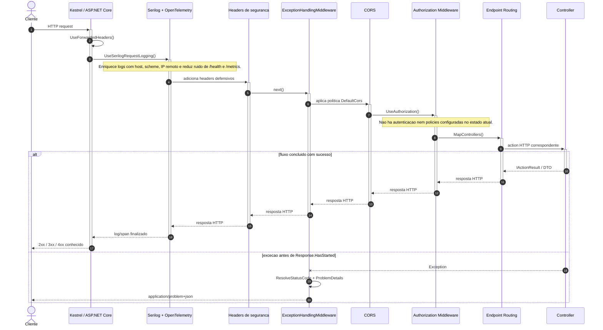

**Passo a passo**

1. O ASP.NET Core recebe a requisição, normaliza os cabeçalhos encaminhados por proxy e inicia logging/tracing.
2. O middleware de segurança adiciona cabeçalhos defensivos como `X-Content-Type-Options`, `X-Frame-Options` e `Referrer-Policy`.
3. `ExceptionHandlingMiddleware` envolve o restante do pipeline para transformar exceções em `ProblemDetails`.
4. CORS e autorização são avaliados antes do roteamento para controllers.
5. Em sucesso, o controller retorna o resultado HTTP. Em erro não tratado, o middleware central converte a exceção para uma resposta padronizada.

### 2. Autenticação e autorização no estado atual

Este diagrama documenta explicitamente o comportamento de segurança existente. O projeto chama `UseAuthorization()`, mas não registra `AddAuthentication()`, não chama `UseAuthentication()` e os controllers não possuem `[Authorize]`. Portanto, as rotas atuais são públicas do ponto de vista de autenticação/autorização da aplicação.

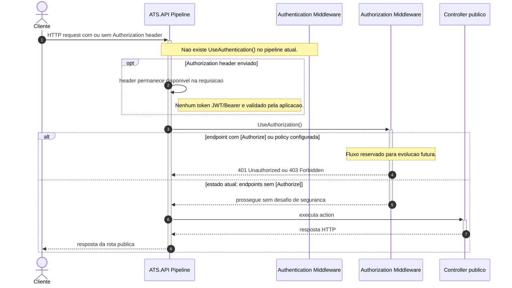

**Passo a passo**

1. O cliente pode enviar ou omitir um cabeçalho `Authorization`; hoje isso não altera o comportamento da API.
2. Como não há middleware de autenticação, nenhum principal autenticado é construído.
3. `UseAuthorization()` não encontra metadados de autorização nos endpoints e permite a execução.
4. A implementação de JWT, roles e policies está registrada no Roadmap como melhoria futura.

### 3. Criação de candidato

Executado em `POST /api/v1/candidatos`. O fluxo cria um candidato após validar unicidade de e-mail, construir o agregado no domínio e persistir no MongoDB.

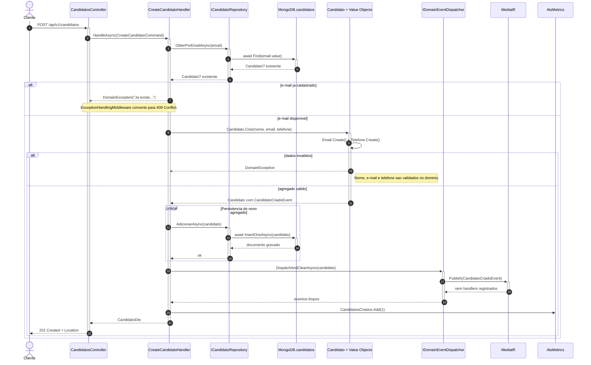

**Passo a passo**

1. O controller recebe o `CreateCandidatoCommand` via model binding e delega a regra para o handler.
2. O handler consulta o repositório por e-mail para bloquear duplicidade antes da criação.
3. O domínio valida nome, e-mail e telefone, normalizando e-mail para minúsculas e telefone para dígitos.
4. O repositório grava o documento em `candidatos`; a infraestrutura também cria índice único em `email.value`.
5. O dispatcher publica e limpa o `CandidatoCriadoEvent`; como não há handler registrado para esse evento, não há efeito colateral adicional.
6. A métrica de negócio é incrementada e a API responde `201 Created`.

### 4. Publicação e fechamento de vaga

Este fluxo cobre `POST /api/v1/vagas` e `PATCH /api/v1/vagas/{id}/fechar`. Ele evidencia as regras de domínio de publicação, validação de salário e transição de estado da vaga.

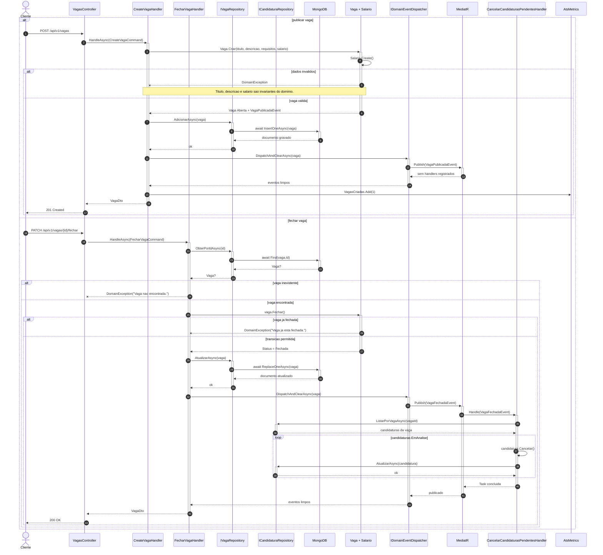

**Passo a passo**

1. Na publicação, a entidade `Vaga` valida título, descrição e salário, cria o agregado em estado `Aberta` e registra `VagaPublicadaEvent`.
2. Na persistência, `VagaRepository` grava em `vagas` usando `MongoDB.Driver` e o dispatcher publica o evento.
3. No fechamento, o handler busca a vaga antes de alterar o estado.
4. `Vaga.Fechar()` impede fechar uma vaga que já está fechada; o middleware traduz esse caso para `409 Conflict`.
5. A atualização é feita por substituição do documento da vaga e, em seguida, `VagaFechadaEvent` é publicado.
6. `CancelarCandidaturasPendentesHandler` consome o evento e cancela candidaturas `EmAnalise` relacionadas à vaga.

### 5. Consultas por ID e listagens paginadas

Executado em `GET /api/v1/candidatos`, `GET /api/v1/candidatos/{id}`, `GET /api/v1/vagas` e `GET /api/v1/vagas/{id}`. O fluxo mostra a separação entre queries, repositórios e projeção para DTO.

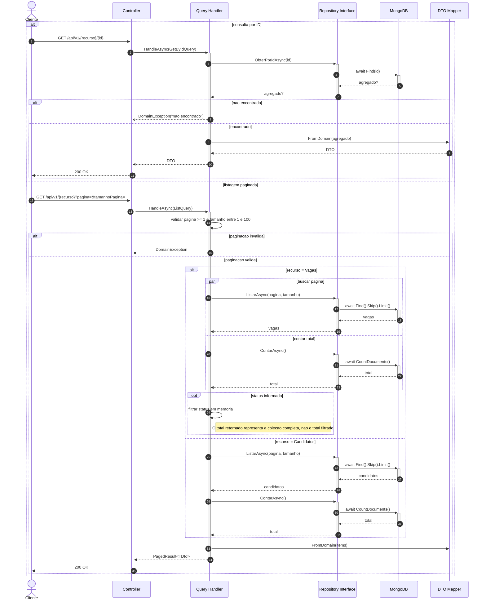

**Passo a passo**

1. Consultas por ID retornam `404` via `DomainException` quando o agregado não existe.
2. Listagens validam paginação no handler, não no controller.
3. Repositórios isolam a API do `MongoDB.Driver`.
4. `ListVagasHandler` busca lista e total em paralelo com `Task.WhenAll`.
5. DTOs são montados na camada Application, mantendo o domínio livre de detalhes HTTP.

### 6. Atualização de candidato e vaga

Executado em `PUT /api/v1/candidatos/{id}` e `PUT /api/v1/vagas/{id}`. O fluxo mostra validações de existência, conflitos de e-mail e regras de edição de vaga fechada.

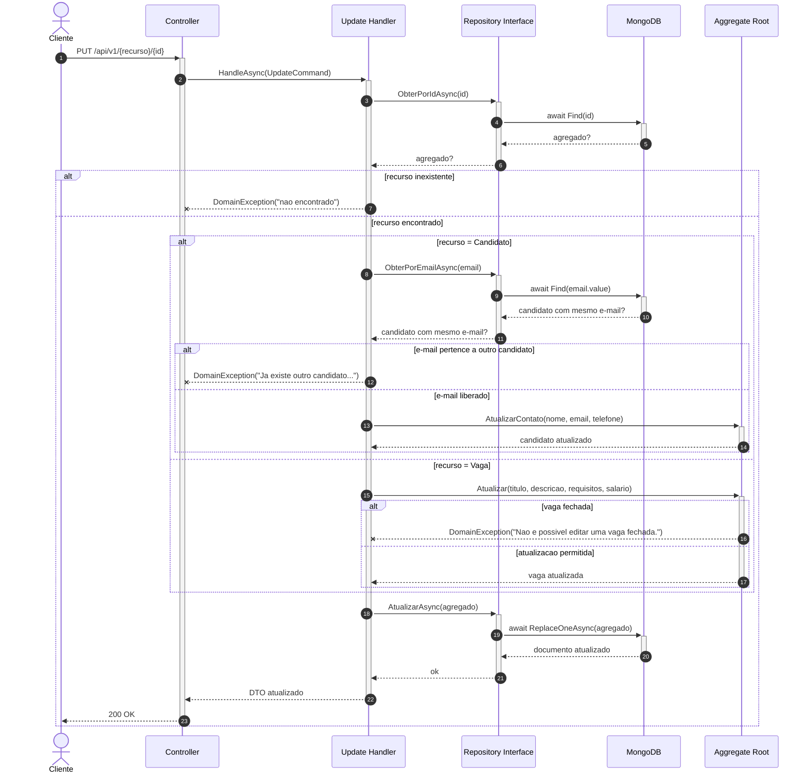

**Passo a passo**

1. O handler sempre busca o agregado antes de mutar estado.
2. Atualização de candidato executa uma checagem adicional de e-mail para preservar unicidade.
3. Atualização de vaga delega ao domínio a regra que bloqueia edição quando `Status = Fechada`.
4. A persistência usa `ReplaceOneAsync`, substituindo o documento do agregado.
5. Conflitos de regra de negócio são tratados de forma uniforme pelo middleware.

### 7. Remoção de candidato e vaga

Executado em `DELETE /api/v1/candidatos/{id}` e `DELETE /api/v1/vagas/{id}`. O fluxo remove o agregado após confirmar sua existência.

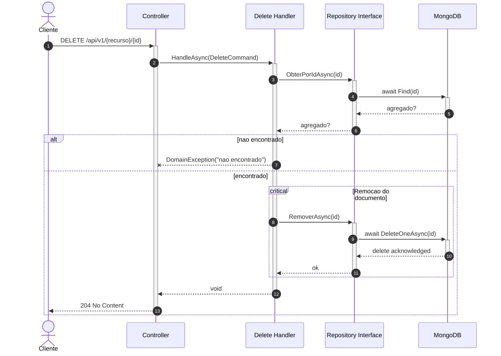

**Passo a passo**

1. A remoção é precedida por leitura para diferenciar `404 Not Found` de remoção bem-sucedida.
2. O domínio não possui método de exclusão; a remoção é uma operação de aplicação/persistência.
3. Não há cascade ou verificação de candidaturas relacionadas antes de remover candidato ou vaga.
4. Em sucesso, o controller retorna `204 No Content`.

### 8. Adição de currículo ao candidato

Executado em `POST /api/v1/candidatos/{id}/curriculo`. Esse é um fluxo de atualização parcial do agregado `Candidato`, com validação de formato de arquivo no value object `Curriculo`.

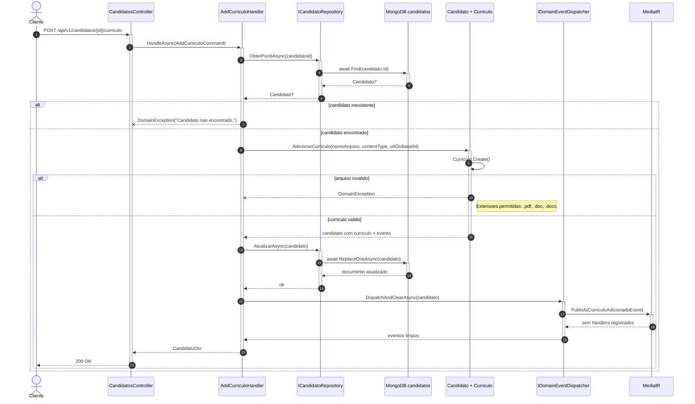

**Passo a passo**

1. O handler busca o candidato pelo ID recebido na rota.
2. `Candidato.AdicionarCurriculo()` delega validações para `Curriculo.Create()`.
3. O domínio exige nome de arquivo, conteúdo e extensão permitida.
4. O candidato inteiro é persistido novamente com o currículo anexado.
5. O dispatcher publica e limpa `CurriculoAdicionadoEvent`; atualmente não há handler registrado para esse evento.
6. O retorno é o `CandidatoDto`, já refletindo `PossuiCurriculo = true`.

### 9. Criação de candidatura

Executado em `POST /api/v1/candidaturas`. É o fluxo mais crítico do domínio, pois cruza três agregados: candidato, vaga e candidatura.

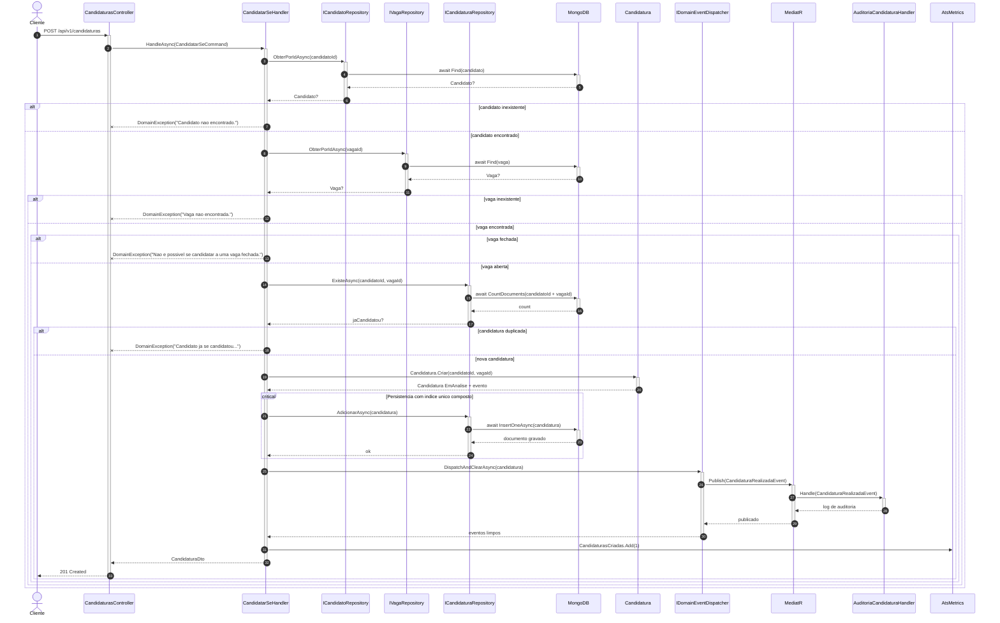

**Passo a passo**

1. O handler garante que candidato e vaga existem antes de criar a candidatura.
2. A regra de vaga fechada é avaliada antes da checagem de duplicidade.
3. O repositório verifica se já existe uma candidatura para o par `candidatoId + vagaId`.
4. O domínio cria a candidatura em status `EmAnalise` e registra o evento `CandidaturaRealizadaEvent`.
5. O repositório de infraestrutura cria índice único composto para reforçar a unicidade no MongoDB.
6. O dispatcher publica `CandidaturaRealizadaEvent`, que é consumido por `AuditoriaCandidaturaHandler`.

### 10. Aprovação, reprovação e cancelamento de candidatura

Executado em `PATCH /api/v1/candidaturas/{id}/aprovar`, `PATCH /api/v1/candidaturas/{id}/reprovar` e `PATCH /api/v1/candidaturas/{id}/cancelar`. O fluxo representa as transições de estado controladas pela entidade `Candidatura`.

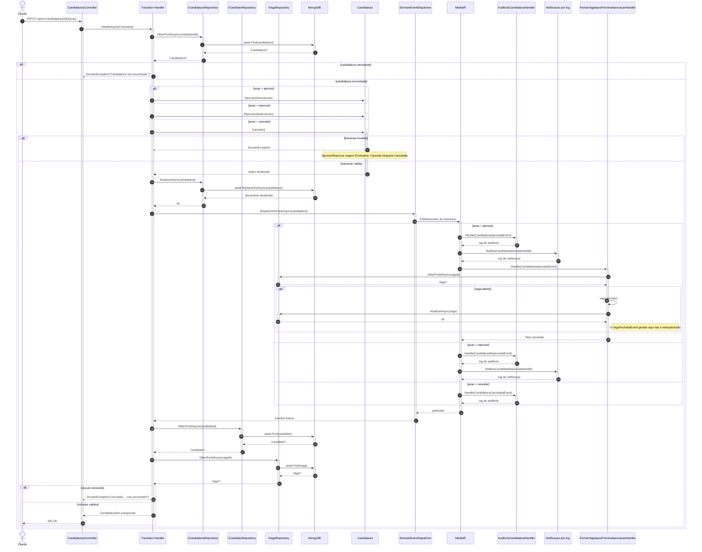

**Passo a passo**

1. O handler carrega a candidatura e delega a transição à entidade.
2. `Aprovar` e `Reprovar` só aceitam candidaturas em `EmAnalise`.
3. `Cancelar` impede cancelar novamente uma candidatura já cancelada.
4. Após persistir a mudança, o handler publica o evento gerado pela transição.
5. Eventos de aprovação/reprovação geram logs de notificação e auditoria; aprovação também tenta fechar a vaga relacionada.
6. Após o dispatch, o handler busca candidato e vaga para retornar nomes no DTO.
7. Caso os vínculos tenham sido removidos, a resposta de erro é produzida após a alteração já ter sido persistida.

### 11. Consulta detalhada e listagem de candidatos por vaga

Executado em `GET /api/v1/candidaturas/{id}` e `GET /api/v1/candidaturas/vagas/{vagaId}/candidatos`. Esses fluxos montam DTOs de leitura combinando candidatura, candidato e vaga.

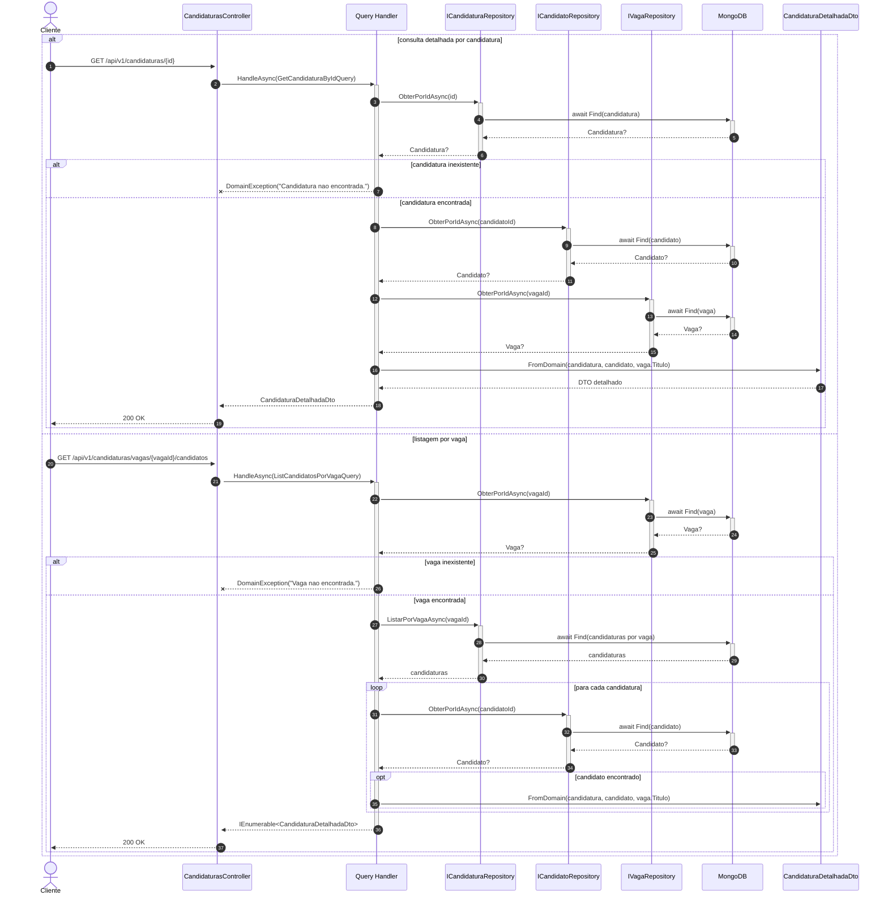

**Passo a passo**

1. A consulta detalhada exige que candidatura, candidato e vaga existam.
2. A listagem por vaga valida a existência da vaga antes de buscar candidaturas.
3. Para cada candidatura, o handler busca o candidato individualmente.
4. Candidatos ausentes são ignorados na listagem por vaga, enquanto a consulta por ID falha se o vínculo estiver ausente.
5. A montagem do DTO fica na Application, mantendo controllers sem lógica de composição.

### 12. Tratamento centralizado de erros

Este fluxo é acionado sempre que uma exceção atravessa controllers e handlers sem tratamento local. A resposta final segue o formato `application/problem+json`.

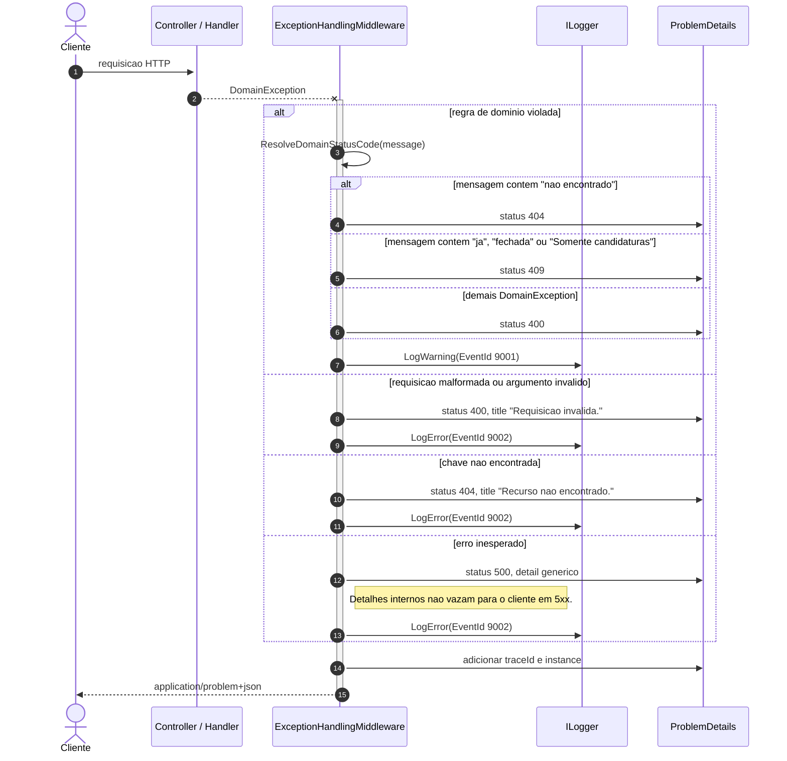

**Passo a passo**

1. O middleware captura exceções somente enquanto a resposta ainda não começou.
2. `DomainException` usa a mensagem como sinal semântico para decidir entre `400`, `404` e `409`.
3. Erros inesperados viram `500` com detalhe sanitizado.
4. Todas as respostas incluem `traceId`, facilitando correlação com logs.
5. Erros de domínio são registrados como warning; os demais como error.

### 13. Observabilidade, métricas e health checks

Este fluxo cobre os endpoints operacionais e integrações externas de observabilidade: Prometheus para scraping, MongoDB para readiness e OTLP/Jaeger quando configurado.

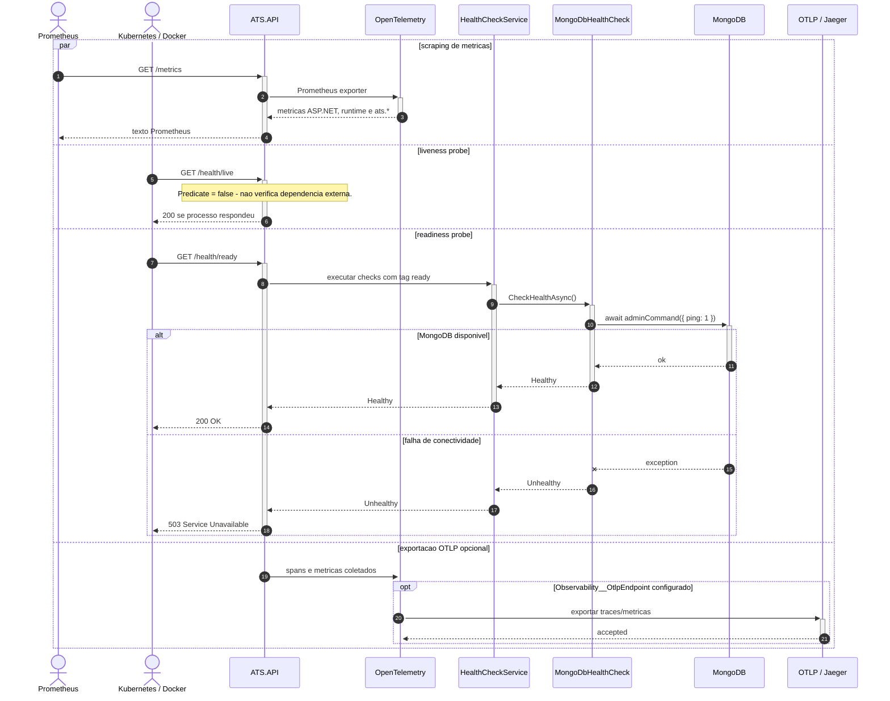

**Passo a passo**

1. `/metrics` é mapeado por `UseObservability()` quando `EnablePrometheusEndpoint` está habilitado.
2. `/health/live` valida apenas que o processo responde.
3. `/health/ready` executa `MongoDbHealthCheck`, que envia `ping` ao MongoDB.
4. OpenTelemetry coleta instrumentação ASP.NET Core, `HttpClient`, runtime e métricas de negócio `ats.*`.
5. Exportação OTLP ocorre somente quando `Observability__OtlpEndpoint` está configurado.

### Observações de arquitetura identificadas

- **Autenticação/autorização:** não há autenticação JWT, roles, policies ou `[Authorize]` implementados. O uso de `UseAuthorization()` hoje não protege as rotas.
- **Validação:** não há camada de validators externos como FluentValidation. As validações vivem em handlers e, principalmente, nos métodos/factories do domínio.
- **Eventos de domínio:** existe dispatch interno via MediatR, mas não há outbox, retry persistente ou mensageria externa.
- **Redispatch em event handlers:** eventos gerados dentro de event handlers, como `VagaFechadaEvent` no fechamento automático após aprovação, não são publicados novamente.
- **Transações:** não há sessões/transações MongoDB. Cada operação de repositório é uma chamada independente.
- **Paginação de vagas filtradas:** `ListVagasHandler` pagina primeiro e filtra por status em memória depois; o `Total` retornado continua sendo o total geral da coleção.
- **Remoções sem integridade referencial:** exclusão de candidato ou vaga não verifica candidaturas relacionadas, podendo deixar candidaturas com vínculos ausentes.
- **Concorrência em candidatura:** o handler verifica duplicidade antes de inserir e o MongoDB possui índice único composto. Em uma corrida concorrente, uma violação de índice pode emergir como exceção de infraestrutura não mapeada explicitamente para `409 Conflict`.
- **Composition root:** `ATS.Infrastructure.DependencyInjection` registra também handlers da Application. Funciona, mas separar registros de Application e Infrastructure deixaria as dependências mais explícitas.

---

## Testes

O projeto possui **645 testes** distribuídos em cinco projetos:

| Projeto | Tipo | Foco |
|---------|------|------|
| `ATS.Domain.Tests` | Unitário | Entidades, Value Objects, invariantes de domínio |
| `ATS.Application.Tests` | Unitário | Handlers, event handlers e mocks estritos de repositórios |
| `ATS.Infrastructure.Tests` | Integração | Repositórios contra MongoDB e dispatcher MediatR |
| `ATS.API.Tests` | Unitário | Controllers, ExceptionHandlingMiddleware, ObservabilityExtensions |
| `ATS.E2E.Tests` | E2E | Fluxos completos com Testcontainers + MongoDB real |

Resumo refletido nos badges do topo: **594** testes unitários/integração sem E2E + **51** testes E2E = **645** testes.

Cobertura específica de eventos de domínio:
- `ATS.Domain.Tests` valida criação dos eventos e acúmulo em `DomainEvents`.
- `ATS.Application.Tests` valida dispatch após persistência e comportamento dos `INotificationHandler<TEvent>`.
- `ATS.Infrastructure.Tests` valida `MediatRDomainEventDispatcher`, publicação via `IMediator` e limpeza dos eventos do agregado.

### Executar todos os testes unitários

```bash
dotnet test --filter "FullyQualifiedName!~Integration&FullyQualifiedName!~E2E"
```

### Executar apenas os testes E2E

> Requer Docker em execução (Testcontainers sobe o MongoDB automaticamente).

```bash
dotnet test tests/ATS.E2E.Tests/ATS.E2E.Tests.csproj
```

### Executar a suite completa

```bash
dotnet test
```

---

## Cobertura de código

Cobertura atual de linhas: **98.2%** (`942/959` linhas cobertas), conforme o relatório local em `coverage-report/Summary.txt`.

### Coletar cobertura

```bash
# Limpar resultados anteriores
rm -rf coverage-results coverage-report

# Executar testes com coleta de cobertura
dotnet test \
  --filter "FullyQualifiedName!~Integration&FullyQualifiedName!~E2E" \
  --collect:"XPlat Code Coverage" \
  --results-directory ./coverage-results \
  -- DataCollectionRunSettings.DataCollectors.DataCollector.Configuration.Format=cobertura \
     DataCollectionRunSettings.DataCollectors.DataCollector.Configuration.ExcludeByAttribute=GeneratedCodeAttribute \
     DataCollectionRunSettings.DataCollectors.DataCollector.Configuration.ExcludeByFile="**/Program.cs,**/Shared/**,**/I*.cs,**/*Command.cs,**/*Dto.cs,**/*Injection.cs,**/*Map.cs,**/*Request.cs"
```

### Gerar relatório HTML

```bash
# Instalar a ferramenta (uma única vez)
dotnet tool install --global dotnet-reportgenerator-globaltool

# Gerar o relatório
reportgenerator \
  -reports:"./coverage-results/**/coverage.cobertura.xml" \
  -targetdir:"./coverage-report" \
  -reporttypes:"Html;Badges;TextSummary"

# Abrir no macOS
open coverage-report/index.html
```

---

## Observabilidade

O projeto implementa os três pilares de observabilidade configurados em `ObservabilityExtensions`:

### Logs estruturados (Serilog)

- **Development**: saída de console com template legível por humanos (`[HH:mm:ss LVL] SourceContext Message`)
- **Production**: saída de console em **JSON compacto** (Compact JSON Formatter) — pronto para ingestão por Elastic, Loki, Datadog, etc.
- Enriquecimento automático: `EnvironmentName`, `MachineName`, `ThreadId`, contexto da requisição
- Logs de requisição via `UseSerilogRequestLogging` com nível `Verbose` para `/health` e `/metrics`

### Tracing distribuído (OpenTelemetry)

- Instrumentação automática de ASP.NET Core e `HttpClient`
- Filtro: ignora spans de `/health` e `/metrics`
- Exporta para OTLP quando `Observability__OtlpEndpoint` está configurado (compatível com Jaeger, Tempo, etc.)

### Métricas (OpenTelemetry + Prometheus)

| Métrica | Tipo | Descrição |
|---------|------|-----------|
| `ats.candidatos.criados` | Counter | Candidatos criados com sucesso |
| `ats.vagas.criadas` | Counter | Vagas publicadas |
| `ats.candidaturas.criadas` | Counter | Candidaturas realizadas |
| Métricas ASP.NET Core | — | Request rate, duration, active connections |
| Métricas .NET Runtime | — | GC, thread pool, alocações |

Endpoint de scraping: `GET /metrics`

### Health Checks

| Endpoint | Verifica | Uso típico |
|----------|----------|-----------|
| `/health/live` | Processo está vivo | Liveness probe (Kubernetes) |
| `/health/ready` | Conectividade com MongoDB | Readiness probe (Kubernetes) |

---

## Decisões técnicas

### Domain-Driven Design (DDD)

Cada agregado (`Candidato`, `Vaga`, `Candidatura`) é a unidade de consistência do domínio. Toda regra de negócio vive dentro das entidades — sem lógica de domínio vazando para handlers ou controllers. Value Objects (`Email`, `Telefone`, `Salario`) encapsulam validação e igualdade estrutural.

### CQRS-style com handlers explícitos

Commands e Queries são separados em pastas distintas dentro de `ATS.Application`. Cada caso de uso é invocado diretamente pelo controller por meio de um handler explícito, sem pipeline genérico de MediatR para comandos/queries. O MediatR é usado apenas para publicação interna de eventos de domínio.

Essa abordagem foi escolhida por:
- Eliminar a indireção de pipeline genérico para um projeto com escopo bem definido
- Facilitar rastreamento de chamadas em IDEs (Go to Definition funciona diretamente)
- Manter o registro de handlers visível e explícito em `DependencyInjection.cs`

### Domain Events com MediatR

Agregados adicionam eventos à coleção `DomainEvents` durante mudanças de estado relevantes. Handlers de Application persistem o agregado e chamam `IDomainEventDispatcher`, implementado por `MediatRDomainEventDispatcher`, para publicar e limpar esses eventos.

Esse modelo mantém o domínio livre de dependências de infraestrutura, mas permite acionar comportamentos secundários como auditoria, logs de notificação e automações internas. Como não há outbox transacional, os efeitos colaterais de evento são consistentes com o processo em memória, não com uma fila durável.

### Repository Pattern

Interfaces definidas no domínio (`IXRepository`), implementadas na infraestrutura. O domínio nunca referencia `MongoDB.Driver` diretamente — a inversão de dependência protege o núcleo do negócio de mudanças tecnológicas.

### Source-generated `[LoggerMessage]`

Todos os logs estruturados nos handlers usam o atributo `[LoggerMessage]` (geração de código em tempo de compilação). Isso elimina boxing de parâmetros, verifica `IsEnabled` antes de construir a string de log e garante performance zero-cost quando o nível de log está desabilitado.

### ExceptionHandlingMiddleware com ProblemDetails

Um único middleware centraliza todo tratamento de exceções e serializa respostas no formato **RFC 7807 (Problem Details)**. O `DomainException` é mapeado para códigos HTTP semanticamente corretos (404 para "não encontrado", 409 para conflito de estado). Detalhes internos de exceções inesperadas nunca vazam para o cliente.

### MongoDB sem ORM

O uso direto do `MongoDB.Driver` com mapeamento explícito via `BsonClassMap` permite:
- Controle total sobre nomes de campos e serialização
- Ausência de "magic" que dificulta debugging
- Manter as entidades de domínio livres de atributos de persistência

---

## Convenções de desenvolvimento

### Nomenclatura

| Elemento | Convenção | Exemplo |
|----------|-----------|---------|
| EventId dos logs | `1xxx` Candidatos, `2xxx` Vagas, `3xxx` Candidaturas, `9xxx` Middleware | `9001`, `1001` |
| Campos de log | Apenas IDs de entidade, nunca PII | `CandidatoId`, `VagaId` |
| Handlers | Sufixo `Handler`, método `HandleAsync` | `CreateCandidatoHandler.HandleAsync` |
| Commands/Queries | Record com propriedades imutáveis | `CreateCandidatoCommand(string Nome, ...)` |
| Testes | `Deve[Resultado]Quando[Condicao]` | `DeveLancarExcecaoQuandoCandidatoNaoExistir` |
| Branches | `feature/`, `fix/`, `chore/`, `docs/` | `feature/autenticacao-jwt` |

### Regras de domínio

- Entidades só se constroem via factory method estático (ex.: `Candidato.Criar(...)`)
- Setters são `private` — toda mutação passa por métodos com nome semântico
- Erros de regra de negócio são `DomainException`, nunca exceções genéricas

### Formatação

```bash
# Verificar formatação
dotnet format --verify-no-changes

# Aplicar formatação
dotnet format
```

Warnings são tratados como erros no build (`TreatWarningsAsErrors=true`).

---

## Tratamento de erros

O `ExceptionHandlingMiddleware` intercepta todas as exceções não tratadas e produz uma resposta `application/problem+json` conforme RFC 7807:

```json
{
  "status": 404,
  "title": "Candidatura não encontrada.",
  "detail": "Candidatura não encontrada.",
  "instance": "/api/v1/candidaturas/abc-123",
  "traceId": "00-4bf92f3577b34da6a3ce929d0e0e4736-00f067aa0ba902b7-01"
}
```

| Exceção | Status HTTP | Título |
|---------|-------------|--------|
| `DomainException` (não encontrado) | 404 | Mensagem do domínio |
| `DomainException` (conflito) | 409 | Mensagem do domínio |
| `DomainException` (validação) | 400 | Mensagem do domínio |
| `BadHttpRequestException` | 400 | "Requisição inválida." |
| `ArgumentException` | 400 | "Requisição inválida." |
| `KeyNotFoundException` | 404 | "Recurso não encontrado." |
| Qualquer outra | 500 | "Erro interno no servidor." |

Exceções 5xx são registradas com `LogLevel.Error`; exceções de domínio com `LogLevel.Warning`.  
Detalhes internos **nunca** são expostos em respostas 5xx.

---

## CI/CD

O pipeline de CI roda no **GitHub Actions** (`.github/workflows/ci.yml`) com quatro jobs paralelos após o build:

```
┌─────────┐
│  Build  │
└────┬────┘
     │
     ├──────────────┬──────────────┬────────────────┐
     ▼              ▼              ▼                ▼
┌──────────┐  ┌──────────┐  ┌──────────┐  ┌──────────────┐
│  Unit    │  │   E2E    │  │   Code   │  │  (futuro:    │
│  Tests   │  │  Tests   │  │ Quality  │  │   Deploy)    │
│ +Coverage│  │          │  │          │  └──────────────┘
└──────────┘  └──────────┘  └──────────┘
```

| Job | O que faz |
|-----|-----------|
| **Build** | Restaura, compila com `TreatWarningsAsErrors=true` |
| **Unit Tests** | Roda tests unitários, coleta cobertura Cobertura XML, valida threshold mínimo de 30%, publica relatório |
| **E2E Tests** | Roda testes E2E (Testcontainers + MongoDB real), publica relatório TRX |
| **Code Quality** | Verifica `dotnet format`, audita pacotes vulneráveis com `dotnet list package --vulnerable` |

Artefatos publicados por run: relatório HTML de cobertura (`coverage-report`), resultados TRX unitários (`test-results`), resultados TRX E2E (`e2e-test-results`).

---

## Documentação BDD

> **Localização:** [`docs/bdd/`](docs/bdd/README.md) — ~101 cenários em Gherkin, pt-BR, prontos para automação com Reqnroll ou SpecFlow.

O diretório [`docs/bdd/`](docs/bdd/) contém a **documentação viva das regras de negócio** no formato **Gherkin / BDD (Behavior-Driven Development)**, escrita em português do Brasil. Os cenários foram extraídos diretamente da implementação — entidades de domínio, handlers, value objects e repositórios — sem comportamentos inventados ou especulativos.

Serve simultaneamente como **especificação executável**, **documentação técnica** e **base de testes automatizados**, legível por desenvolvedores, QA, Product Owners e analistas de negócio.

### Arquivos de funcionalidade

| Arquivo | Contexto de negócio | Cenários |
|---------|--------------------|---------:|
| [Candidatos.feature](docs/bdd/Candidatos.feature) | Cadastro, consulta, atualização, exclusão de candidatos e upload de currículo | 28 |
| [Vagas.feature](docs/bdd/Vagas.feature) | Publicação, consulta, listagem com filtro, atualização e encerramento de vagas | 24 |
| [Candidaturas.feature](docs/bdd/Candidaturas.feature) | Candidatura, aprovação, reprovação, cancelamento e ciclo de vida do processo seletivo | 31 |
| [Paginacao.feature](docs/bdd/Paginacao.feature) | Regras de paginação aplicáveis a todas as listagens | 9 |
| [TratamentoDeErros.feature](docs/bdd/TratamentoDeErros.feature) | Respostas padronizadas de erro (Problem Details — RFC 7807) | 9 |

### Tags para execução seletiva

| Tag | Uso |
|-----|-----|
| `@Smoke` | Cenários essenciais — verificação rápida de sanidade |
| `@Critical` | Regras críticas — devem passar antes de qualquer release |
| `@Candidatos`, `@Vagas`, `@Candidaturas` | Execução por agregado de domínio |
| `@CicloDeVida` | Transições de estado dos agregados |

```bash
# Executar apenas smoke tests (com Reqnroll/SpecFlow)
dotnet test --filter "Category=Smoke"

# Executar cenários críticos
dotnet test --filter "Category=Critical"

# Executar um agregado específico
dotnet test --filter "Category=Candidaturas"
```

Consulte o [docs/bdd/README.md](docs/bdd/README.md) para convenções de escrita, instruções de automação com Reqnroll e notas sobre comportamentos implícitos identificados no código.

---

## Roadmap

Melhorias planejadas para versões futuras:

- [ ] **Autenticação e autorização** — JWT Bearer com roles (Recrutador, Admin)
- [ ] **Criação explícita de índices MongoDB** — índice em `Email.Value` para unicidade de candidatos, índice composto em `CandidatoId + VagaId` para candidaturas
- [ ] **Paginação com cursor** — substituir paginação por offset por paginação baseada em cursor para melhor performance em grandes volumes
- [ ] **Outbox e mensageria para eventos de domínio** — persistir eventos e publicar em RabbitMQ / Azure Service Bus com retry e rastreabilidade
- [ ] **FluentValidation** — validação declarativa de Commands com mensagens de erro detalhadas
- [ ] **Rate limiting** — throttling por IP/usuário nas rotas públicas
- [ ] **Audit log** — registro imutável de todas as transições de estado das candidaturas
- [ ] **Dashboard Grafana** — dashboards pré-configurados para as métricas `ats.*`
- [ ] **Multi-tenancy** — isolamento de dados por empresa/cliente

---

## Licença

Distribuído sob a licença **MIT**. Consulte o arquivo [LICENSE](LICENSE) para mais informações.

---

## Autor

**Marlon Reis**  
[marlonreis.dev@outlook.com](mailto:marlonreis.dev@outlook.com)  
[github.com/MarlonReis](https://github.com/MarlonReis/ATS.TalentTrack)
